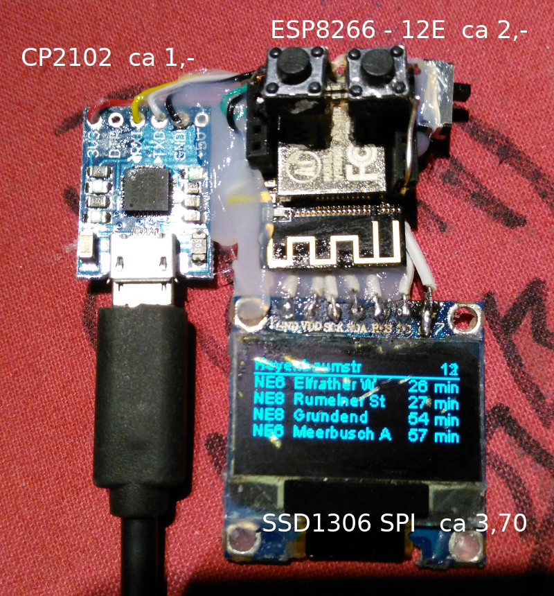

# oled-ESP8266-monitor

Abfahrtsmontor mit Update via Wifi (ESP8266) und oled Display

# Image

# Schaltung

Komische Belegungen:

	static const uint8_t D0   = 16;
	static const uint8_t D1   = 5;
	static const uint8_t D2   = 4;
	static const uint8_t D3   = 0;
	static const uint8_t D4   = 2;
	static const uint8_t D5   = 14;
	static const uint8_t D6   = 12;
	static const uint8_t D7   = 13;
	static const uint8_t D8   = 15;
	static const uint8_t D9   = 3;
	static const uint8_t D10  = 1;

Initialize the OLED display using SPI

	GPIO 14 D5 -> CLK
	GPIO 13 D7 -> MOSI (DOUT)
	GPIO 16 D0 -> RES
	GPIO  4 D2 -> DC
	GPIO 15 D8 -> CS

# Hinweise

- [OLED](https://github.com/squix78/esp8266-oled-ssd1306)
- [Programmieren](http://fkainka.de/esp8266-in-der-arduino-ide/)
- [Getting Started ESP8266](http://www.instructables.com/id/Getting-Started-with-the-ESP8266-ESP-12/)
- [Schriftart machen](http://oleddisplay.squix.ch/)
