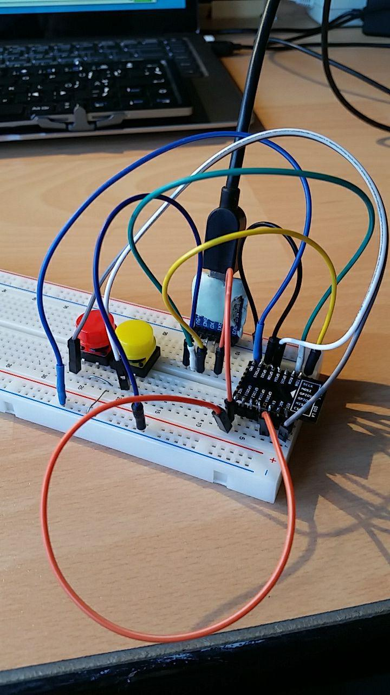

# oled-ESP8266-monitor

VRR bus and tram with update via WiFi (ESP8266) und oled display

# Image

# Pinout

Ugly names and numbers makes ESP developing hard:

    static const uint8_t D0   = 16;
    static const uint8_t D1   = 5;  // i2c SCL
    static const uint8_t D2   = 4;  // i2c SDA
    static const uint8_t D3   = 0;  // PRESS this with RST (reset) to GND: Enable flash/programm mode!
    static const uint8_t D4   = 2;  // wifi LED (with 10k resistor to 3.3V or leave open to flash)
    static const uint8_t D5   = 14; // pwm
    static const uint8_t D6   = 12; // pwm
    static const uint8_t D7   = 13;
    static const uint8_t D8   = 15; // pwm (with 10k resistor to GND to enable flash)
    static const uint8_t D9   = 3;  // RX
    static const uint8_t D10  = 1;  // TX
    static const uint8_t D11  = 9;  // does only work without elf2image  --flash_mode dio
    static const uint8_t D12  = 10; // does only work without elf2image  --flash_mode dio

The gpio's 6..11 are brocken on ESP-201.

EN Pin set to 3.3V (high) all the time! Sometimes D0 and D4: I did not use/wireing them.

Initialize the OLED display using SPI

    GPIO 14 D5 -> CLK
    GPIO 13 D7 -> MOSI (DOUT)
    GPIO 16 D0 -> RES
    GPIO  4 D2 -> DC
    GPIO 15 D8 -> CS

# Hinweise

- [OLED](https://github.com/squix78/esp8266-oled-ssd1306)
- [Programmieren](http://fkainka.de/esp8266-in-der-arduino-ide/)
- [Getting Started ESP8266](http://www.instructables.com/id/Getting-Started-with-the-ESP8266-ESP-12/)
- [Schriftart machen](http://oleddisplay.squix.ch/)

WiFi may need a lot of power! Some UART chips/boards have 3.3V Pin but can not support enough Ampere you need!
The GPIO Pins of the ESP may not work with 3 LEDs (they need to much power) and it result in ESP reboot/reset loop!